# Project 4 - Design & Plan

Be clear and concise in your writing. Bullets points are acceptable.


# Planning

## Client Description (Milestone 1)
> Tell us about your client. Who is your client? What kind of website do they want? What are their key goals?

 - The client: E.Motion.
 - E.Motion is a k-pop dance group at Cornell. Formed in 2013, E.Motion has performed at numerous events across campus, filmed dance covers for youTube and won international cover contests. They want a website that is cohesive by providing a location where all of their information, events, and covers are in one place. Their key goals include sharing the love for dance with the community.

> NOTE: **If you are redesigning an existing website, give us the current URL and some screenshots of the current site.** Tell us how you plan to update the site in a significant way that meets the Project 4 requirements.


## Site's Purpose (Milestone 1)
> Tell us the purpose of the website and what it is all about.

The purpose of the website is to cohesively provide information about what E.Motion is and what they do with the content being covers, events, how to join, and etc.


## Client Meeting Notes (Milestone 1)
> Include your notes/minutes from the client meeting, an email they sent you, or whatever you used to keep track of what was discussed at the meeting.

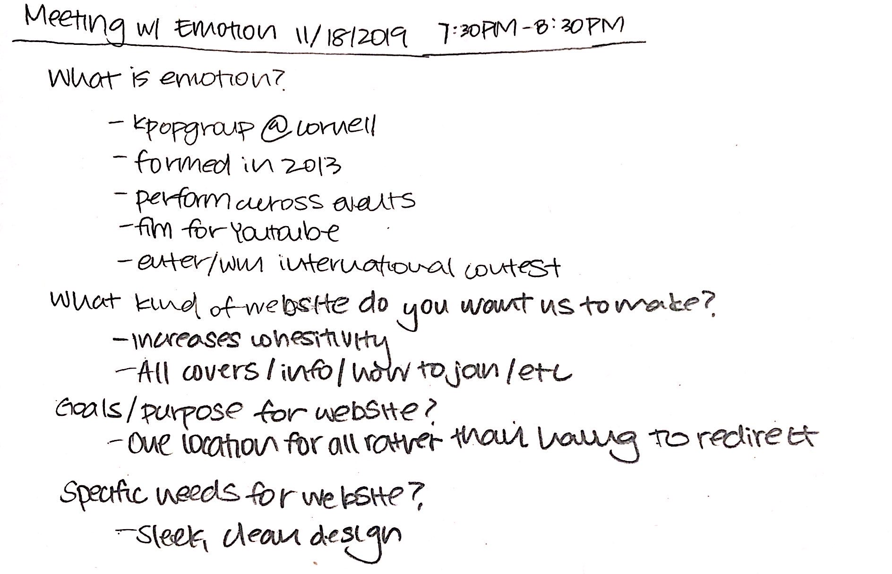


## Client Needs and Wants (Milestone 1)
> Collect your client's needs and wants for the website. Come up with several appropriate design ideas on how those needs may be met. In the **Memo** field, justify your ideas and add any additional comments you have. There is no specific number of needs required for this, but you need enough to do the job.

Needs/Wants: About Page
- **Needs and Wants** [What does your client need and want?]
  - They want to increase a more "cohesive" image for their group and "information about them," as stated in the notes. The perfect place to do this is would be on a website that explains who they are in one page.
- **Design Ideas and Choices** [How will you meet those needs and wants?]
  - We plan to make an "about page" with a wide photo featuring their entire team. We will also make a "who we are" and "mission and values" section to further explain their history and why they are passionate about dance.
- **Memo** [Justify your decisions; additional notes.]
  - TODO

Need/Want: Events Page
- **Needs and Wants** [What does your client need and want?]
  - On the same theme of cohesiveness, they also want a place where people can find all their performances and events.
- **Design Ideas and Choices** [How will you meet those needs and wants?]
  - We will create an events page that features their upcoming event(s) on the top and past events as they scroll down. This also includs any visuals such as quartercards, photos from past events, etc.
- **Memo** [Justify your decisions; additional notes.]
  - TODO
Need/Want: Eboard Page
- **Needs and Wants** [What does your client need and want?]
  - In other to spread more information about the club, they want a team page as well to display featured and dedicated members
- **Design Ideas and Choices** [How will you meet those needs and wants?]
  - We will meet these needs by designing an "eboard" page featuring the members on their executive board team. This will include their names and short descriptions of who they are. We will use flex box to have these individual profiles line up in rows of three or four.
- **Memo** [Justify your decisions; additional notes.]
  - TODO
Need/Want: Apply Page
- **Needs and Wants** [What does your client need and want?]
  - Our client also wants a "how to join" page to make that process easily accessible for others that are interested in their team.
- **Design Ideas and Choices** [How will you meet those needs and wants?]
  - We will meet the needs by creating a final page as an "apply" page. This will allow students to understand the process of joining and when the next applications will come out. Currently, their applications are not opened so there will be a big sign explaining "check back during Spring 2020 for more information"
- **Memo** [Justify your decisions; additional notes.]
  - TODO


## User(s) (Milestone 1)
> Tell us about the users (target audience) for this website.

Our target audience for this this site would be Cornell Students interested in learning more about E.Motion. This includes students interested in learning more about the organization in general, applying, or attending a concert. Because the site would also include ticket ordering form, our audience not only includes Cornell students interested in joining E.Motion but also includes people interesting in attending a ticket from E.Motion. Considering majority of the people ordered tickets and went to E.Motion events are Cornell students and staffs, our users would be Cornell students and staffs interested in Kpop.

## Discovering Users' Needs (Milestone 1)
> You'll need to discover your users' needs. Talk to them! Document what you've learned about them. When talking to your users, take notes and include those notes here.

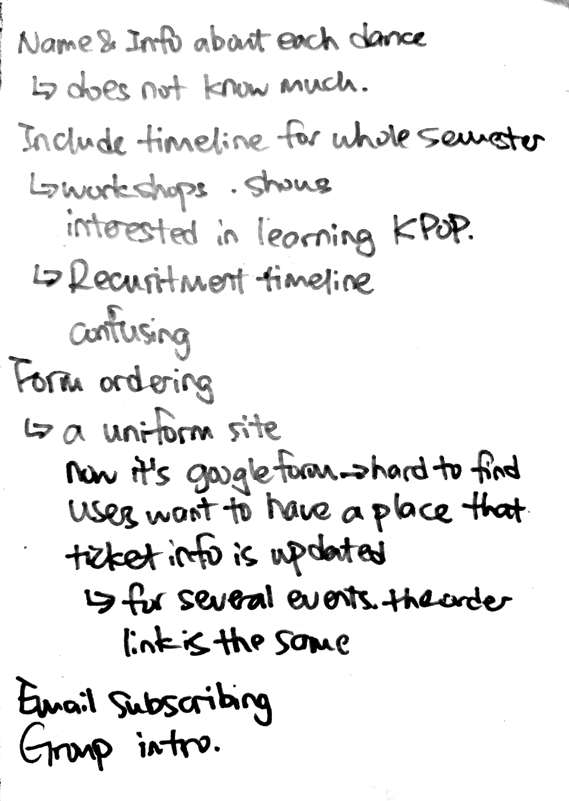

## Users' Needs (Milestone 1)
> Analyze the users' needs and wants from your notes above. List each need/want below. There is no specific number of needs required for this, but you need enough to do the job.
> **Note:** These are probably *not* the needs of your client.

Need/Want: Information about each dance
- **Needs and Wants** [What do the users need and want?]
  - The user wants to have information (e.g. name, dancer, etc) about the dance.
- **Design Ideas and Choices**
  - Would include the information along with the screenshots in the gallery.
- **Rationale & Additional Notes**
  - When designing for past event part of the event page, we would include detailed information of the dance next to the screenshots.

Need/Want: Include timeline for the whole semester
- **Needs and Wants**
  - The user would like to have a calendar of when each workshop and show is.
- **Design Ideas and Choices**
  - Include the timeline in the events page.
- **Rationale & Additional Notes**
  - However, as E.Motion finished majority of their events for this semester and is still working on their schedule for next semester, this design is currently not doable.

Need/Want: Form
- **Needs and Wants**
  - Want E.Motion to use the same URL for ticket ordering instead of using different Google form each time.
- **Design Ideas and Choices**
  - Include ticket ordering form for the latest event on the top of the event page.
- **Rationale & Additional Notes**
  - We would include the ticket ordering form for the latest event on the top of the event page. The page would be changed before each new event.

Need/Want: Email subscribing
- **Needs and Wants**
  - Want E.Motion to have monthly newsletter and update them with the newest events for the month.
- **Design Ideas and Choices**
  - Design a subscription form on the about page.
- **Rationale & Additional Notes**
  - E.Motion does not have its own monthly newsletter. This plan is currently not doable.

Need/Want: Group intro
- **Needs and Wants**
  - User want to know more about members of E.Motion.
- **Design Ideas and Choices**
  - A separate webpage for E-board.
- **Rationale & Additional Notes**
  - Because E.Motion has many members and members change a lot on semester bases. Proving detailed information about the E-board can give the users a rough idea about the club.

## User Testing Plan (Milestone 1)
> Plan out your tasks for evaluating whether your site will meet the needs of the users. These must be actual user testing tasks. Tasks are not questions!

1. Order 2 tickets for the next upcoming show.

2. Find what emotion danced in the past.

3. Find the president of emotion.

4. Apply to join emotion.


## Content (Milestone 1)
> Plan out your site's content (text, images, etc.). Make a list of **all** the content you will need. This list should be **exhaustive**.

  - About
  	- Image of the team
  - Paragraph describing emotion
  - Their vision and values
  - Events
  	- Upcoming showcase
  - Gallery Photos from past showcases
  - E-board
  	- Headshots/names of E-Board
  	- short E-Board bios
  - Apply / Join
  - Each page has same footer about email to contact/link to facebook/link to youtube/link to instagram


## Interactivity Ideas (Milestone 1)
> Come up with some idea for interactive features for your site.

  - Ticket order form (no payment)
  - E-Board member bios pop up upon clicking their name/headshot.


# Design & Evaluation

## Design Process (Milestone 1)
> Document your design process. Show us your card sorting. Design your navigation from the card sorting. Outline your navigation. Describe your theme. Show us sketches of your site (mobile and desktop versions). etc.

> You should show us how your came up with your design and how your iterated on that design; show us the evolution of your design.

> **Note:** Card sorting is used to organize your site's content. For each piece of content identified in the previous section, write a summary of that content onto a card. Now sort the cards. The grouping of cards provides you with your pages for your website. **Do not write down the pages you want and then "card sort" those. That is not card sorting.**

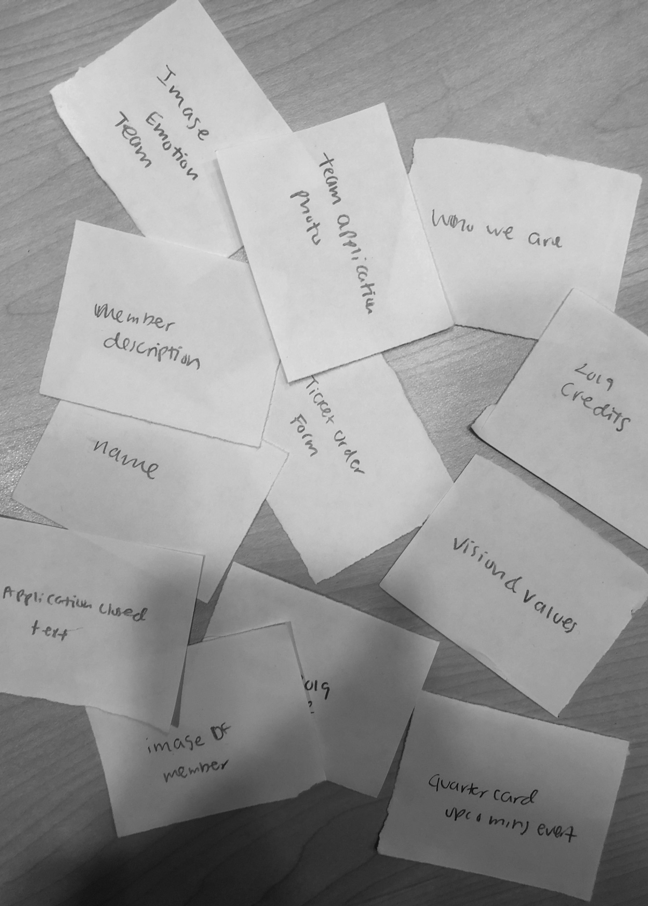
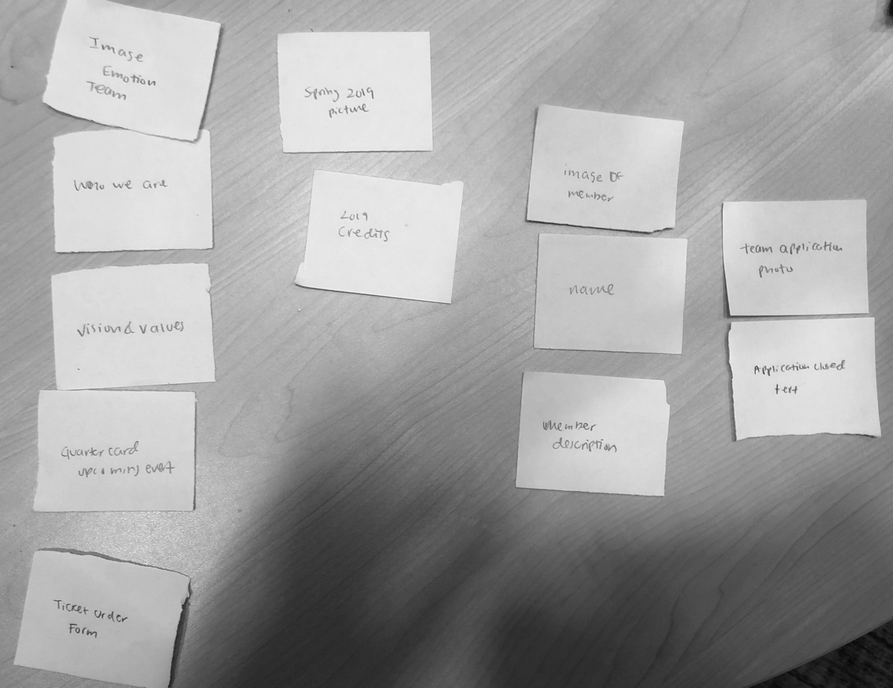
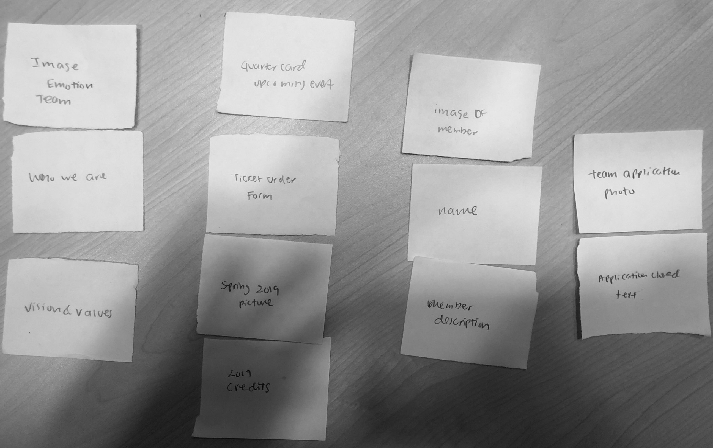

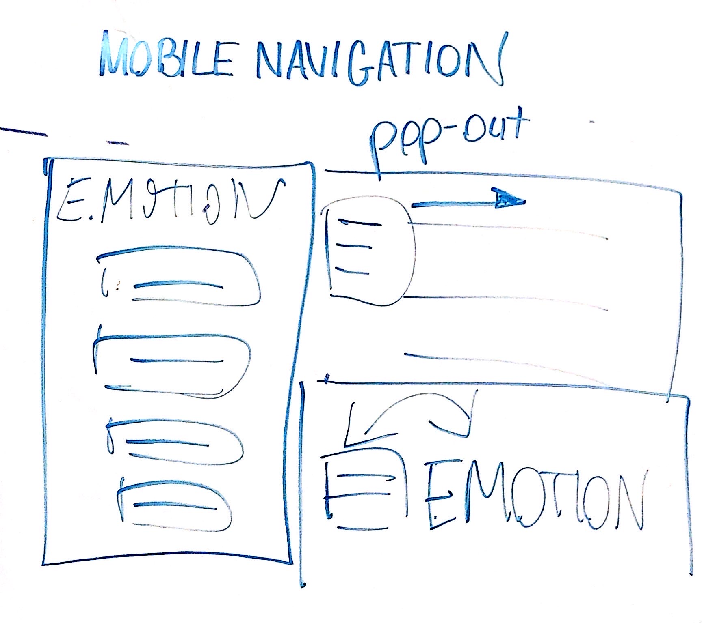
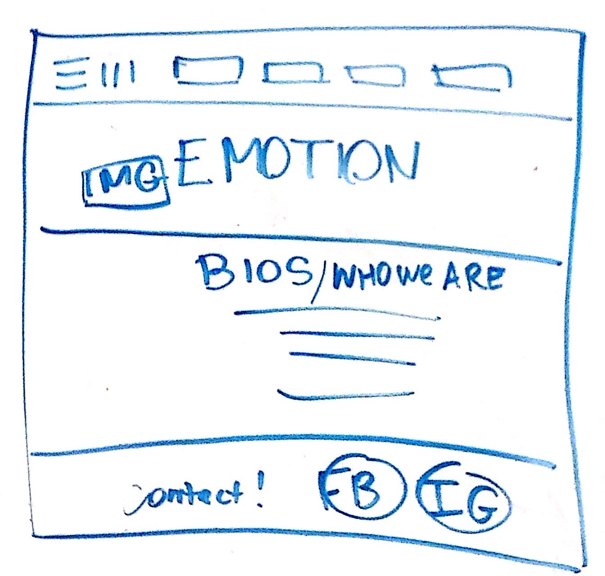
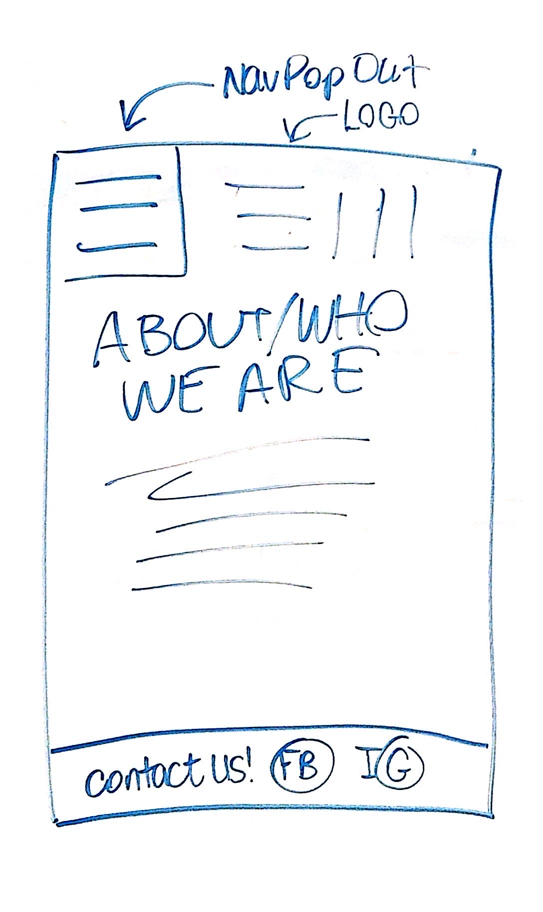

Our first card sort shows all the content our client would like scrambled. Our second card sorting included the quarter card and information about their upcoming showcase. However, we thought that it would be better if that was grouped into the events page because that reflects more of the page and not in the about page. Our third card sort reflects these changes. We card sorted three times which resulted in the creation of navigation pages about, events, eboard, and apply.

Our thought process behind our design came directly from the needs and wants of our client. The about page features a team photo, "who we are", and E.Motion's mission and values. This reflects the basics of who their group is for users who would like to learn more about this dance group. The events page has their upcoming events and past events with credits, quartercards, and other corresponding images. This is helpful for users who are interested in finding consolidated information about their performances in the future but also what they've done in the past. The interactive ticket form allows users to directly purchase this ticket from the website. This fits with the client's wants of having all the information needed in one place. The eboard page features the key eboard members, their name, majors, and other basic information. Finally, our apply page shows basic information about the application process for Spring 2020.

Our overall theme is clean but lively. We have a white background, simple and sleek with a black logo. We will have medium sized fonts so the pictures will speak for themselves. In terms of clean, our background colors and primary black colors will emphasize this. For our liveliness, we will incorporate a lot of images to show descriptions and the actual works of Emotion. Our theme fits with our user's needs because they are Cornell students looking to find more information about E.Motion. They will appreciate a clean theme that is clear to follow but also lively photos that shows the actual work of E.Motion. The theme fits with our client's needs because their main requirement is to show centralized information about their group. Our client's aesthetic is a clean image, shown with their logo and quick dance moves. That will be reflected in the theme of the website. Our client is also a dance group so they would appreciate a lively theme that shows how interactive their dances are.

## Interactivity (Milestone 1)
> What interactive features will your site have? Describe how the interactivity connects with the needs of the clients/target audience.

- Ticket Order form (no payment) - allows client to sell tickets to audience without in-person contact
- E-board bios pop out after clicking the person’s name - this allows the bios to be part of the page (thus highlighting the group’s membership) without cluttering the page.
- Mobile Navigation bar pop-out: the navigation bar appears after clicking on the navigation icon. This creates a cleaner mobile site experience for the user.
- Desktop Navigation link hover holographic: the responsiveness of the navigation link provides positive feedback to the user that it's a clickable link.


## User Testing (_optional_)
> This testing is optional.

### User 1 - Testing Notes (Milestone 1)
> When conducting user testing, you should take notes during the test. Place your notes here.

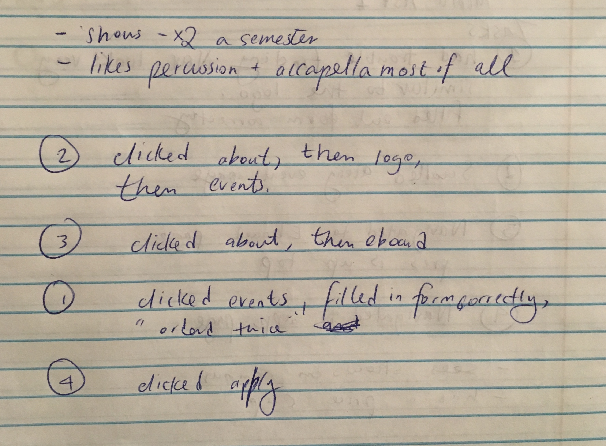

### User 1 (Milestone 1)
> Using your notes from above, describe your user by answering the questions below.

1. Who is your user, e.g., where does the user come from, what is the user's job, characteristics, etc.?

User 1 is a senior CS major in the Engineering college at Cornell.  He enjoys music and arts-oriented shows, specially percussion and a-cappella shows.

2. Does the user belong to your target audience of the site? (Yes / No)

Yes
> If “No”, what’s your strategy of associating the user test results to your target audience’s needs and wants? How can your re-design choices based on the user tests make a better fit for the target audience?


### User 1 - **Desktop** (Milestone 1)
> Report the results of your user's evaluation. You should explain **what the user did**, describe the user's **reaction/feedback** to the design, **reflect on the user's performance**, determine what **re-design choices** you will make. You can also add any additional comments. See the example design journey for an example of what this would look like.

Task: Find the location of where E.Motion performed during the Spring 2019 concert.
- **Did you evaluate the desktop or mobile design?**
  - Pick one: desktop
- **How did the user do? Did they meet your expectation?**
  - The user clicked the "about" link, which left them on the same page, then tried clicking the logo, then clicked the events link.
- **User’s reaction / feedback to the design** (e.g., specific problems or issues found in the tasks)
  - The user about it difficult to identify the about page as the home.  
- **Your reflections about the user’s performance to the task**
  - I think this issue could be resolved by either renaming the "about" link to "home" or by having the actual website be clear in this. The paper draft was not entirely explicit and the user seemed distracted at the time of the test.  
- **Re-design choices**
  - N/A
- **Additional Notes**
  - TODO: Justify your decisions; additional notes.

Task: You are an Cornell student interested in learning more about the team behind E.Motion. Find the current president's name and major of E.Motion.
- **Did you evaluate the desktop or mobile design?**
  - Pick one: desktop
- **How did the user do? Did they meet your expectation?**
  - The user tried to click "about", then clicked the link to the Eboard.
- **User’s reaction / feedback to the design** (e.g., specific problems or issues found in the tasks)
  -  none.  The user swiftly found the correct page.
- **Your reflections about the user’s performance to the task**
  - It was satisfactory.
- **Re-design choices**
  - N/A
- **Additional Notes**
  - TODO: Justify your decisions; additional notes.

Task: Order 2 tickets for the next upcoming show next semester using the email cornell_student@cornell.edu.
- **Did you evaluate the desktop or mobile design?**
  - Pick one: desktop
- **How did the user do? Did they meet your expectation?**
  - The user clicked "events", filled in the form correctly, ordered, and then did it again.
- **User’s reaction / feedback to the design** (e.g., specific problems or issues found in the tasks)
  -  The user calmly did the task and found it easy.
- **Your reflections about the user’s performance to the task**
  - The user had to submit the form twice, which is not optimal to the function
- **Re-design choices**
  - Add a "number of tickets" field to the form.
- **Additional Notes**
  - TODO: Justify your decisions; additional notes.

Task: Learn how to apply to join E.Motion for Spring 2020.
- **Did you evaluate the desktop or mobile design?**
  - Pick one: desktop
- **How did the user do? Did they meet your expectation?**
  - The user pressed the "apply" link.
- **User’s reaction / feedback to the design** (e.g., specific problems or issues found in the tasks)
  - none; the user quickly accepted that he could not apply at this time
- **Your reflections about the user’s performance to the task**
  - The user didn't seem particularly interested in joining, which is valid, because he is a senior with a very limited time left at Cornell.
- **Re-design choices**
  - N/A
- **Additional Notes**
  - TODO: Justify your decisions; additional notes.

...


### User 2 - Testing Notes (Milestone 1)
> When conducting user testing, you should take notes during the test. Place your notes here.

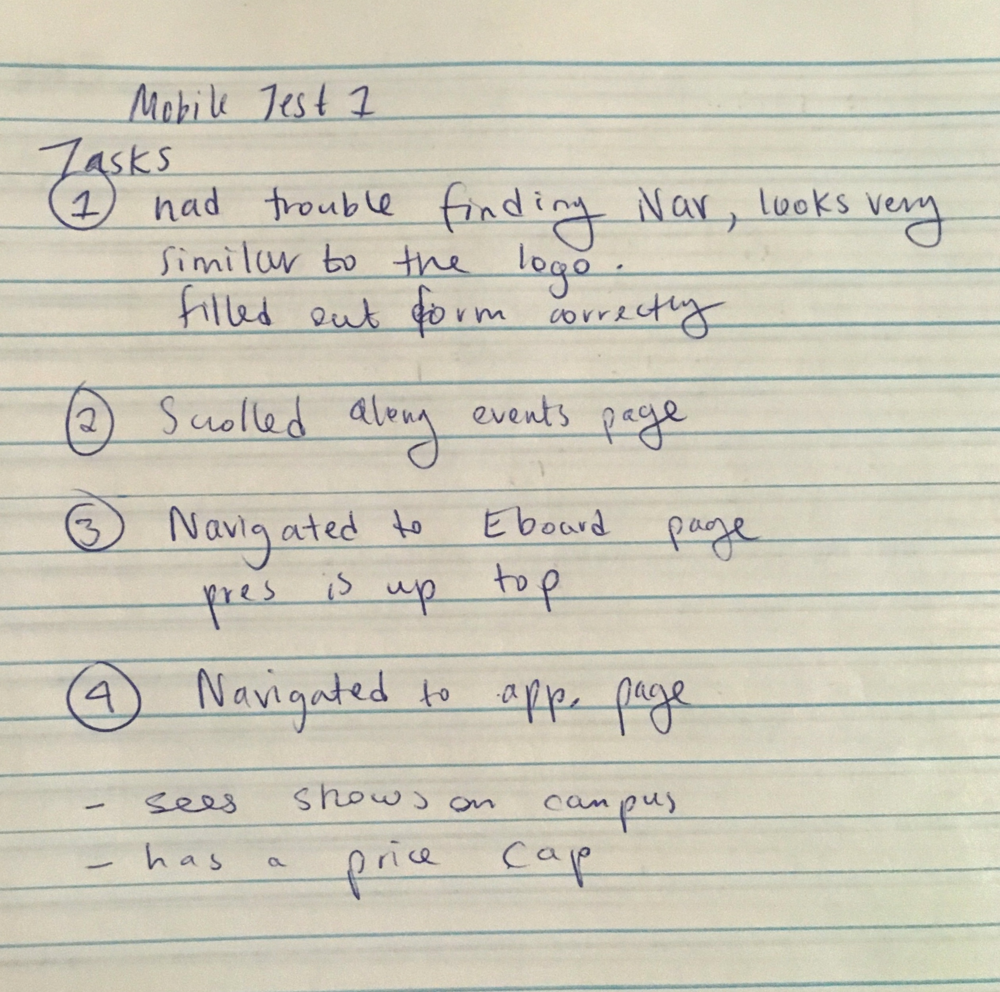

### User 2 (Milestone 1)
> Using your notes from above, describe your user by answering the questions below.

1. Who is your user, e.g., where does the user come from, what is the user's job, characteristics, etc.?
User 2 is a sophomore in the College of Arts and Science at Cornell.  He plays drums and the saxophone, and enjoys campus shows and concerts.  

2. Does the user belong to your target audience of the site? (Yes / No)
> If “No”, what’s your strategy of associating the user test results to your target audience’s needs and wants? How can your re-design choices based on the user tests make a better fit for the target audience?

Yes

### User 2 - **Mobile** (Milestone 1)
> Report the results of your user's evaluation. You should explain **what the user did**, describe the user's **reaction/feedback** to the design, **reflect on the user's performance**, determine what **re-design choices** you will make. You can also add any additional comments. See the example design journey for an example of what this would look like.

Task: Order 2 tickets for the next upcoming show next semester using the email cornell_student@cornell.edu.
- **Did you evaluate the desktop or mobile design?**
  - Pick one: mobile
- **How did the user do? Did they meet your expectation?**
  - The user first attempted clicking the E.motion logo several times before pressing the correct button for navigation.  They navigated to the events page and correctly filled out the form there to order tickets.
- **User’s reaction / feedback to the design** (e.g., specific problems or issues found in the tasks)
  - The user was confused about how to access the site navigation
- **Your reflections about the user’s performance to the task**
  - This was concerning because accessing the navigation is vital to the site's function
- **Re-design choices**
  - Be sure to make the logo and the site navigation visually distinct.
- **Additional Notes**
  - TODO: Justify your decisions; additional notes.

Task: Find the location of where E.Motion performed during the Spring 2019 concert.
- **Did you evaluate the desktop or mobile design?**
  - Pick one: mobile
- **How did the user do? Did they meet your expectation?**
  - The user was already on the Events page, so he scrolled down to view past dance events.  
- **User’s reaction / feedback to the design** (e.g., specific problems or issues found in the tasks)
  - There was no particular issue here.
- **Your reflections about the user’s performance to the task**
  - The cardsort for putting past events on that page with upcoming seemed good.
- **Re-design choices**
  - N/A
- **Additional Notes**
  - TODO: Justify your decisions; additional notes.

Task: You are an Cornell student interested in learning more about the team behind E.Motion. Find the current president's name and major of E.Motion.
- **Did you evaluate the desktop or mobile design?**
  - Pick one: mobile
- **How did the user do? Did they meet your expectation?**
  - The user navigated to the E-Board page and the president was there.  
- **User’s reaction / feedback to the design** (e.g., specific problems or issues found in the tasks)
  - He said "Oh, I know where to find that" and was swift.  
- **Your reflections about the user’s performance to the task**
  - It was an easy task.
- **Re-design choices**
  - N/A
- **Additional Notes**
  - TODO: Justify your decisions; additional notes.

Task: Learn how to apply to join E.Motion for Spring 2020.
- **Did you evaluate the desktop or mobile design?**
  - Pick one: mobile
- **How did the user do? Did they meet your expectation?**
  - The user navigated to the apply page.
- **User’s reaction / feedback to the design** (e.g., specific problems or issues found in the tasks)
  - The user said "oh, sad" upon seeing the message on the page that application were not open.
- **Your reflections about the user’s performance to the task**
  - It was dismaying to see the user sad.  
- **Re-design choices**
  - It might do some good to, upon meeting with the client again, ask if they want more messages on that page with specific dates for recruitment or with opportunities for engagement.
- **Additional Notes**
  - TODO: Justify your decisions; additional notes.

...


## Final Design (Milestone 1)
> Include the final sketches for each of your pages. These sketches **must** hand-drawn.

**Desktop Design:**
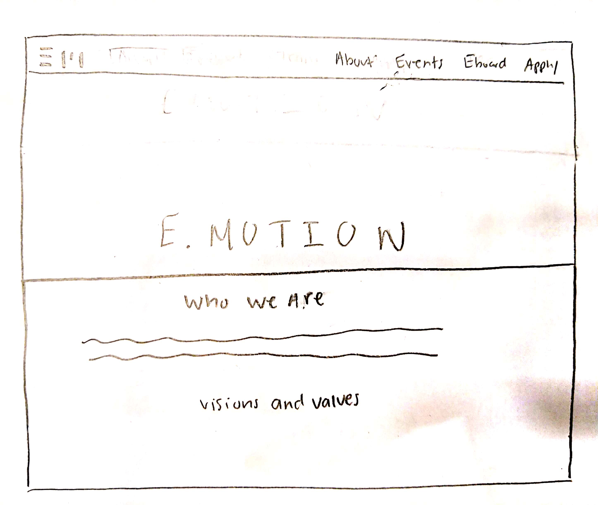
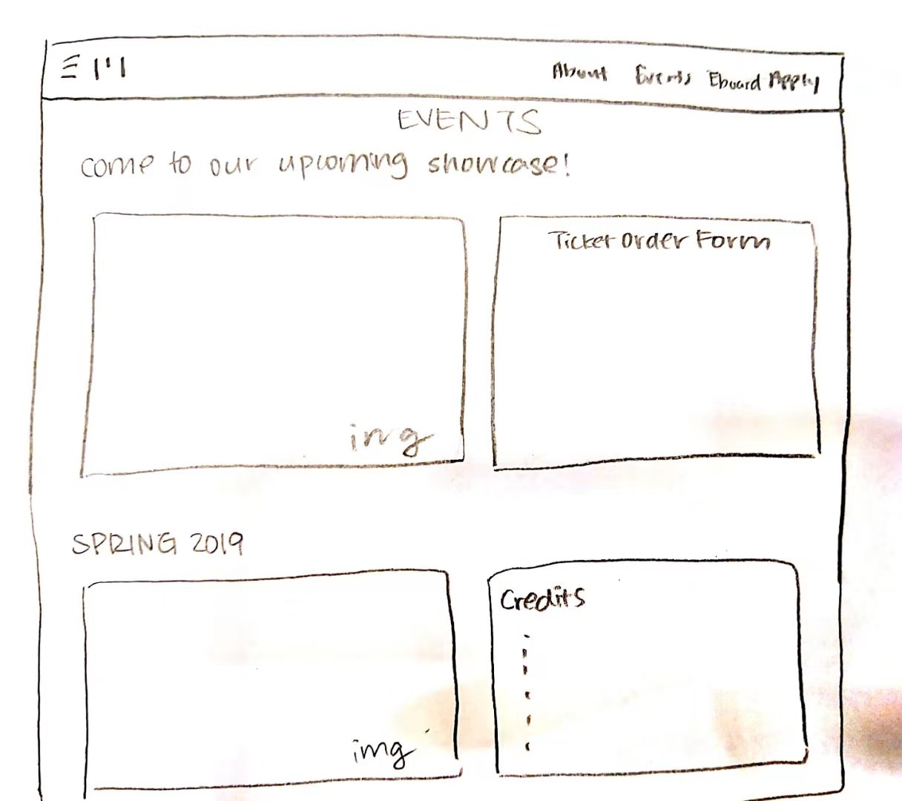
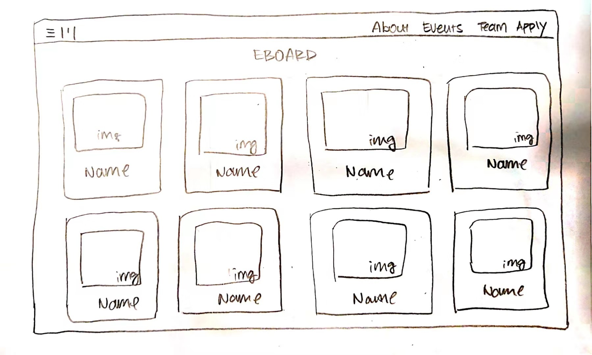
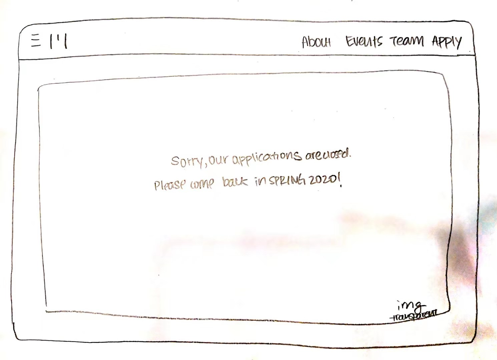
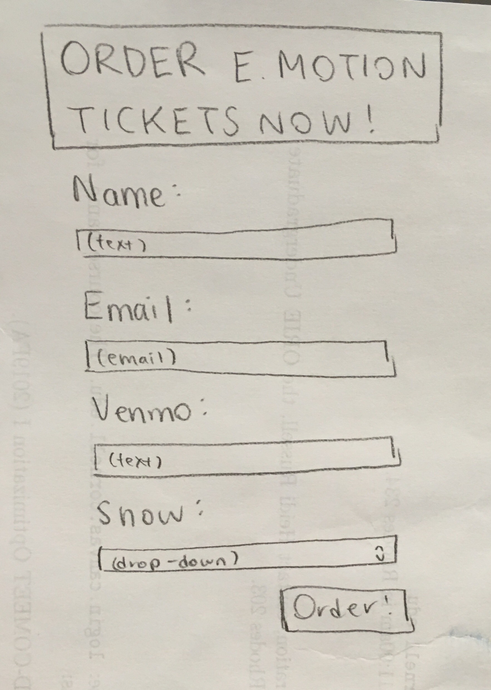

**Mobile Design:**
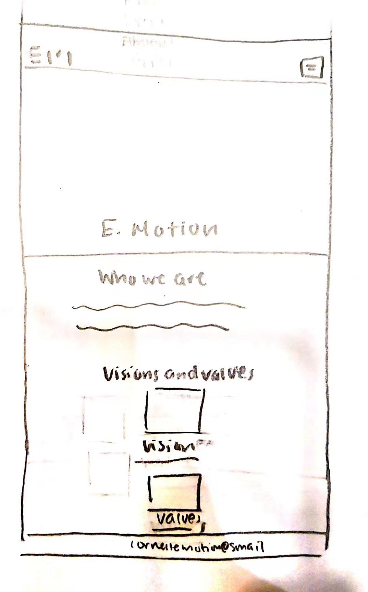
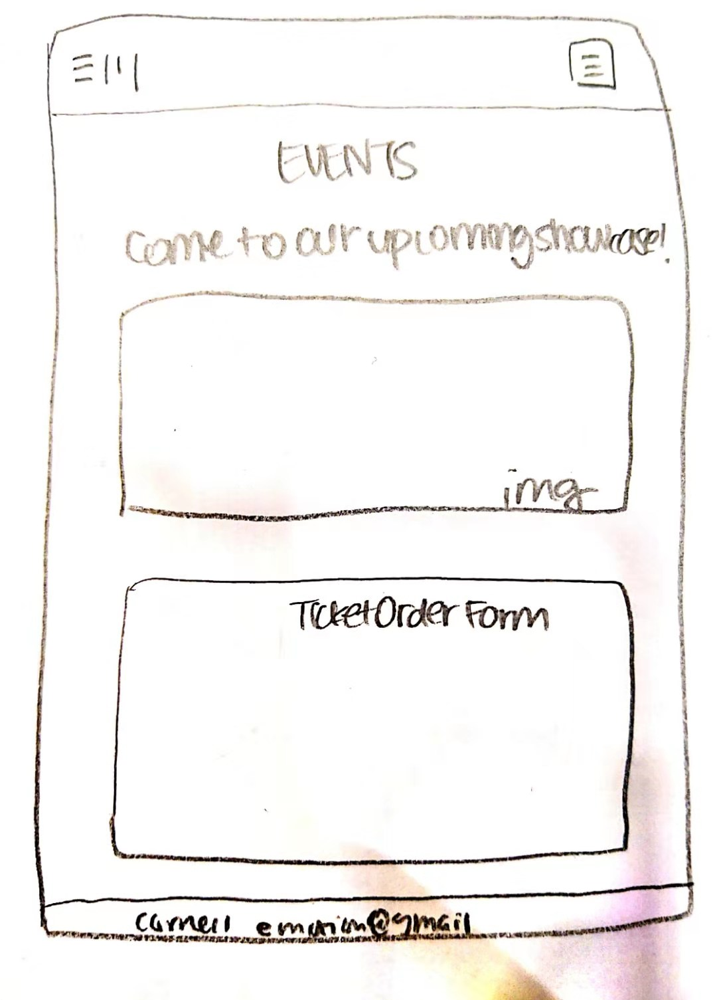
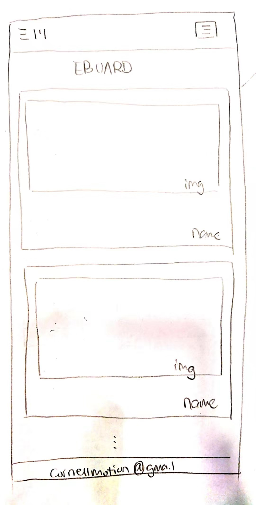
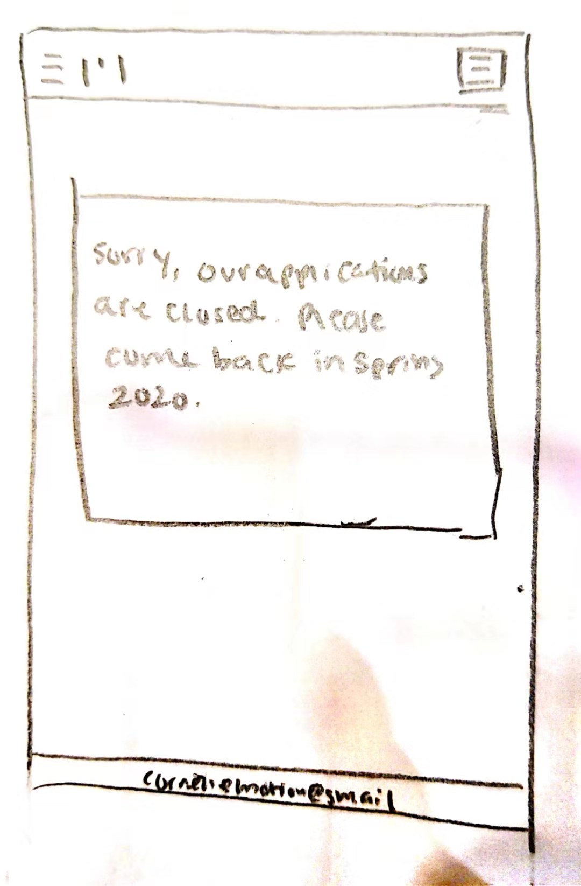
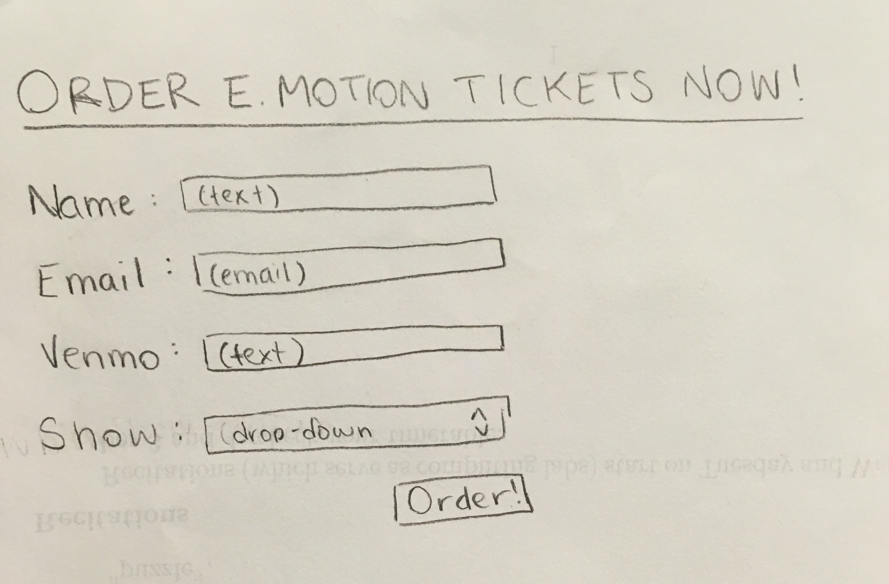

## Additional Comments (Milestone 1)
> If you feel like you haven't fully explained your design choices, or if you want to explain some other functions in your site (such as special design decisions that might not meet the Project 4 requirements), you can use this space to justify your design choices or ask other questions about the project and process.


---

# Iteration 2

## Client Feedback (Milestone 2)
> You have met once with your client a second time to discuss your initial design. Include your notes from the meeting, an email they sent you, or whatever you used to keep track of what was discussed at the meeting. Write a few sentences about the design feedback you received from your client.

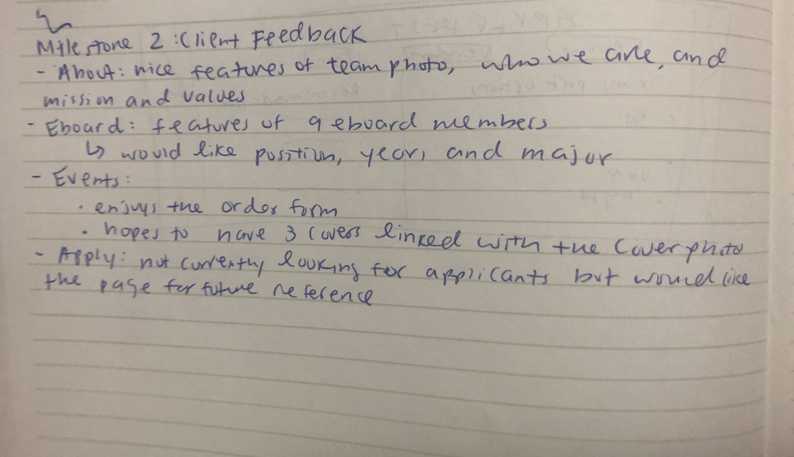

## Interactivity Plan (Milestone 2)
> Write your interactivity pseudocode here.

Example:
```
when DOM is loaded:

  if today is a monday:
    show Monday's soup and Monday's daily special

```
Form Interactivity
```
when DOM is loaded:

  when form is submitted:
    formvalid <-- True

    if name meets HTML validation criteria:
      hide name feedback
    else
      show name feedback
      formvalid <-- False

    if email meets HTML validation criteria:
      hide email feedback
    else
      show email feedback
      formvalid <-- False

    if tickets meets HTML validation criteria:
      hide tickets feedback
    else
      show tickets feedback
      formvalid <-- False

    if pickup meets HTML validation criteria:
      hide pickup feedback
    else
      show pickup feedback
      formvalid <-- False

    send form to server if formvalid is true
```
Eboard Bios
```
when DOM is loaded:
    hide bio
  when eboardindividual is clicked
    show bio
```
Mobile Navigation
```
when DOM is loaded:
  if width less than 800px (mobile)
    hide navigation

    if navigation is hidden
      when navigation button clicked
        show navigation
    else if navigation button no hidden
      when navigation button clicked
        hide navigation
```
Desktop Navigation
```
when DOM is loaded:
  if width 800px or more (desktop)
    hide shimmer effect

    when mouse hovers over navigation link
      show shimmer effect
```
## Additional Comments (Milestone 2)
> If you feel like you haven't fully explained your design choices, or if you want to explain some other functions in your site (such as special design decisions that might not meet the Project 4 requirements), you can use this space to justify your design choices or ask other questions about the project and process.


---

# Iteration 3

## Additional Comments (Milestone 3)
> If you feel like you haven't fully explained your design choices, or if you want to explain some other functions in your site (such as special design decisions that might not meet the Project 4 requirements), you can use this space to justify your design choices or ask other questions about the project and process.


---

# Final Evaluation

## Changes Based on Lab 13 Peer Feedback (Final Submission)
> What changes did you make to your design based on your peers' feedback?

Based on the Lab 13 Peer Feedback, we changed the centering of our design, especially with the images on the index page. We will also be sure to fix our hovering bugs in our eboard page in the desktop version. We decided to add interactivity on our about / index page by making a slideshow for the "Meet the Team" section. We also decided to add a countdown for the apply page.

## User Testing
> If you conducted user testing in Milestone 1, you only need to user test 2 more users. Otherwise, you must conduct user testing with 4 users.

### User 3 - Testing Notes (Final Submission)
> When conducting user testing, you should take notes during the test. Place your notes here.

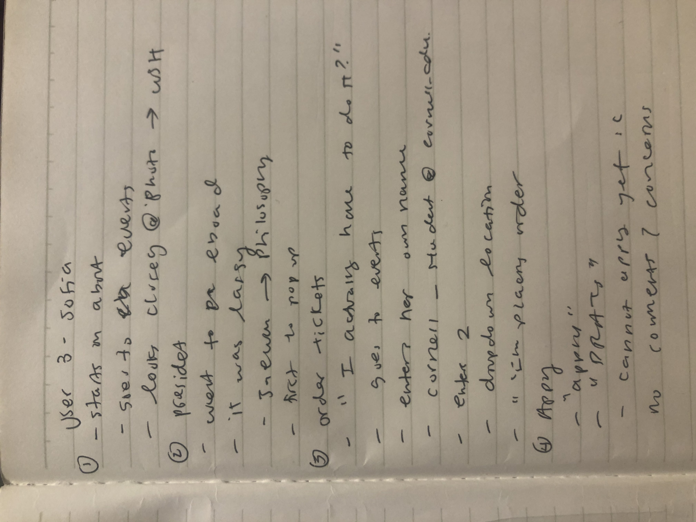

### User 3 (Final Submission)
> Using your notes from above, describe your user by answering the questions below.

1. Who is your user, e.g., where does the user come from, what is the user's job, characteristics, etc.?

User 3 studies Industrial and Labor Relations at Cornell. She is an undergraduate who is passionate about labors rights. She has no job on campus. She is also interested in kpop.

2. Does the user belong to your target audience of the site? (Yes / No)

Yes. She is a Cornell student interested in learning more about E.Motion.
> If “No”, what’s your strategy of associating the user test results to your target audience’s needs and wants? How can your re-design choices based on the user tests make a better fit for the target audience?


### User 3 - **Desktop** (Final Submission)
> Report the results of your user's evaluation. You should explain **what the user did**, describe the user's **reaction/feedback** to the design, **reflect on the user's performance**, determine what **re-design choices** you will make. You can also add any additional comments. See the example design journey for an example of what this would look like.

Task: Find the location of where E.Motion's Weki Meki Dance Workshop is.
- **Did you evaluate the desktop or mobile design?**
  - Pick one: desktop
- **How did the user do? Did they meet your expectation?**
  - She starts in about page, clicks on the events page, looks closely at the pink photo. This met my expectations.
- **User’s reaction / feedback to the design** (e.g., specific problems or issues found in the tasks)
  - The user enjoyed the design as it was very easy to spot the workshop.
- **Your reflections about the user’s performance to the task**
  - I thought the user's performance was great. She was able to efficiently look at the designs
- **Re-design choices**
  - N/A
- **Additional Notes**
  - TODO: Justify your decisions; additional notes.

Task: You are an Cornell student interested in learning more about the team behind E.Motion. Find the current president's name and major of E.Motion.
- **Did you evaluate the desktop or mobile design?**
  - Pick one: desktop
- **How did the user do? Did they meet your expectation?**
  - She went on the eboard site, it was laggy, saw Jaewon as philosophy major as it was first to pop up
- **User’s reaction / feedback to the design** (e.g., specific problems or issues found in the tasks)
  -  She thought the UX was a little laggy
- **Your reflections about the user’s performance to the task**
  - It was satisfactory.
- **Re-design choices**
  - N/A
- **Additional Notes**
  - TODO: Justify your decisions; additional notes.

Task: Order 2 tickets for the next upcoming show next semester using the email cornell_student@cornell.edu.
- **Did you evaluate the desktop or mobile design?**
  - Pick one: desktop
- **How did the user do? Did they meet your expectation?**
  - User asked "do I actually do that" then proceeded to go to events, enters her name, cornell_student@cornell.edu, 2 tickets, and says "I'm placing order"
- **User’s reaction / feedback to the design** (e.g., specific problems or issues found in the tasks)
  -  The user calmly did the task and found it easy.
- **Your reflections about the user’s performance to the task**
  - The user followed all the instructions and I am satisfied with performance
- **Re-design choices**
  - N/A
- **Additional Notes**
  - TODO: Justify your decisions; additional notes.

Task: Learn how to apply to join E.Motion for Spring 2020.
- **Did you evaluate the desktop or mobile design?**
  - Pick one: desktop
- **How did the user do? Did they meet your expectation?**
  - The user pressed the "apply" link.
- **User’s reaction / feedback to the design** (e.g., specific problems or issues found in the tasks)
  - none, the user was disappointed that she could not apply
- **Your reflections about the user’s performance to the task**
  - The user performed the task swiftly and I am satisfied
- **Re-design choices**
  - N/A
- **Additional Notes**
  - TODO: Justify your decisions; additional notes.


### User 4 - Testing Notes (Final Submission)
> When conducting user testing, you should take notes during the test. Place your notes here.

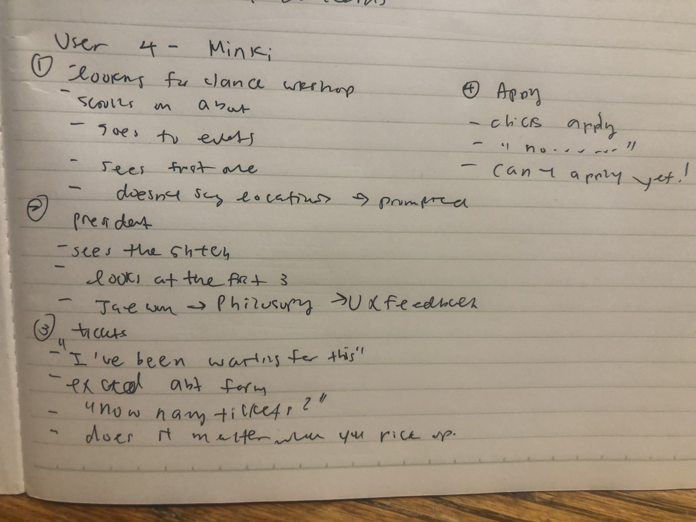

### User 4 (Final Submission)
> Using your notes from above, describe your user by answering the questions below.

1. Who is your user, e.g., where does the user come from, what is the user's job, characteristics, etc.?

User 4 is a economics major in the Arts and Sciences school. He is employed by Student Agencies and is a Cornell sophomore interested in learning more about E.Motion

2. Does the user belong to your target audience of the site? (Yes / No)

Yes
> If “No”, what’s your strategy of associating the user test results to your target audience’s needs and wants? How can your re-design choices based on the user tests make a better fit for the target audience?


### User 4 - **Mobile** (Final Submission)
> Report the results of your user's evaluation. You should explain **what the user did**, describe the user's **reaction/feedback** to the design, **reflect on the user's performance**, determine what **re-design choices** you will make. You can also add any additional comments. See the example design journey for an example of what this would look like.

Task: You are an Cornell student interested in learning more about the team behind E.Motion. Find the current president's name and major of E.Motion.
- **Did you evaluate the desktop or mobile design?**
  - Pick one: mobile
- **How did the user do? Did they meet your expectation?**
  - clicks on events, sees the interactivity switch
- **User’s reaction / feedback to the design** (e.g., specific problems or issues found in the tasks)
  -  none.  The user was able to find the president as she was the first one. He enjoyed the UX experience
- **Your reflections about the user’s performance to the task**
  - I was glad to hear that he had a positive experience and found the president's information.
- **Re-design choices**
  - N/A
- **Additional Notes**
  - TODO: Justify your decisions; additional notes.

Task: Find the location of where E.Motion's Weki Meki Dance Workshop is.
- **Did you evaluate the desktop or mobile design?**
  - Pick one: mobile
- **How did the user do? Did they meet your expectation?**
  - The user scrolls on the about page, goes to events, sees the first one and doesn't say location. He is prompted to say the location. He met my expectations because he was able to locate Willard Straight but needed prompting because he forgot the task.
- **User’s reaction / feedback to the design** (e.g., specific problems or issues found in the tasks)
  - The user found it helpful to have the poster.   
- **Your reflections about the user’s performance to the task**
  - I am satisfied with the user's performance because he was able to locate the event swiftly  
- **Re-design choices**
  - N/A
- **Additional Notes**
  - TODO: Justify your decisions; additional notes.

Task: Learn how to apply to join E.Motion for Spring 2020.
- **Did you evaluate the desktop or mobile design?**
  - Pick one: mobile
- **How did the user do? Did they meet your expectation?**
  - Clicks apply link, expresses "nooooo" This met my expectations because he was able to locate the page.
- **User’s reaction / feedback to the design** (e.g., specific problems or issues found in the tasks)
  - none; the user was upset that he wasn't able to apply for Spring 2020.
- **Your reflections about the user’s performance to the task**
  - I am happy that the user was able to locate this task but he seemed upset because he isn't able to apply.
- **Re-design choices**
  - To make it more positive, we will make a countdown page for the apply page.
- **Additional Notes**
  - TODO: Justify your decisions; additional notes.

Task: Order 2 tickets for the next upcoming show next semester using the email cornell_student@cornell.edu.
- **Did you evaluate the desktop or mobile design?**
  - Pick one: mobile
- **How did the user do? Did they meet your expectation?**
  - The user expressed "I've been waiting for this," was excited to fill out the form and filled out the form accordingly.
- **User’s reaction / feedback to the design** (e.g., specific problems or issues found in the tasks)
  -  The user filled out within a minute and had no complaint.
- **Your reflections about the user’s performance to the task**
  - The form did not go through because we had no internet but otherwise I am satisfied with user's performance.
- **Re-design choices**
  - N/A
- **Additional Notes**
  - TODO: Justify your decisions; additional notes.

### User 5 - Testing Notes (Final Submission)
> When conducting user testing, you should take notes during the test. Place your notes here.


### User 5 (Final Submission)
> Using your notes from above, describe your user by answering the questions below.

1. Who is your user, e.g., where does the user come from, what is the user's job, characteristics, etc.?


2. Does the user belong to your target audience of the site? (Yes / No)
> If “No”, what’s your strategy of associating the user test results to your target audience’s needs and wants? How can your re-design choices based on the user tests make a better fit for the target audience?


### User 5 - **Desktop** (Final Submission)
> Report the results of your user's evaluation. You should explain **what the user did**, describe the user's **reaction/feedback** to the design, **reflect on the user's performance**, determine what **re-design choices** you will make. You can also add any additional comments. See the example design journey for an example of what this would look like.

Task: [TODO: copy task here]
- **Did you evaluate the desktop or mobile design?**
  - Pick one: desktop/mobile
- **How did the user do? Did they meet your expectation?**
  - TODO
- **User’s reaction / feedback to the design** (e.g., specific problems or issues found in the tasks)
  - TODO
- **Your reflections about the user’s performance to the task**
  - TODO
- **Re-design choices**
  - TODO
- **Additional Notes**
  - TODO: Justify your decisions; additional notes.

...


### User 6 - Testing Notes (Final Submission)
> When conducting user testing, you should take notes during the test. Place your notes here.


### User 6 (Final Submission)
> Using your notes from above, describe your user by answering the questions below.

1. Who is your user, e.g., where does the user come from, what is the user's job, characteristics, etc.?


2. Does the user belong to your target audience of the site? (Yes / No)
> If “No”, what’s your strategy of associating the user test results to your target audience’s needs and wants? How can your re-design choices based on the user tests make a better fit for the target audience?


### User 6 - **Mobile** (Final Submission)
> Report the results of your user's evaluation. You should explain **what the user did**, describe the user's **reaction/feedback** to the design, **reflect on the user's performance**, determine what **re-design choices** you will make. You can also add any additional comments. See the example design journey for an example of what this would look like.

Task: [TODO: copy task here]
- **Did you evaluate the desktop or mobile design?**
  - Pick one: desktop/mobile
- **How did the user do? Did they meet your expectation?**
  - TODO
- **User’s reaction / feedback to the design** (e.g., specific problems or issues found in the tasks)
  - TODO
- **Your reflections about the user’s performance to the task**
  - TODO
- **Re-design choices**
  - TODO
- **Additional Notes**
  - TODO: Justify your decisions; additional notes.

...


## Changes Based on User Testing (Final Submission)
> What changes did you make to your design based on user testing?

After our two final user testings, we decided to work on the making sure there are no design glitches in interactivity for the eboard page and adding a count down for the apply page.

## Final Notes to the Graders (Final Submission)
> 1. Give us three specific strengths of your site that sets it apart from the previous website of the client (if applicable) and/or from other websites. Think of this as your chance to argue for the things you did really well.

There is no previous website of the client but our theme of a very clean and simple aesthetic fits the aesthetic of our target audience and our client. The montserrat font, simple white and black theme, and the clean alignment helps cultivate this theme. Another strength would be the interactivity of our page where users may click through the slideshow to see the photos of who actually makes up E.Motion. The user also can hover over different eboard members to see their bios. A third strength would be the form that allows for users to directly buy from our website.

> 2. Tell us about things that don't work, what you wanted to implement, or what you would do if you keep working with the client in the future. Give justifications.

We hoped to have a holographic drop down nav bar on the mobile version for interactivity. However, we were unable to implement this because other interactivity was a priority such as the eboard hovering, the form, and the slideshow. If we had additional time and human capital, we would like to implement this dropdown menu in the future.

> 3. Tell us what you, as a team, learned while working on this project.

Us, as a team, learned that people have various value adds to every team. One person may have in depth experience with javascript while the other may be good at css. It is important to acknowledge these strengths but also give everyone an equal role in coding and designing. Communication is also key to a successful team because messaging each other on Facebook whenever we had questions or was able to begin working made our workflow more streamlined and efficient.

> 4. Tell us anything else you need us to know for when we're looking at the project.

N/A
